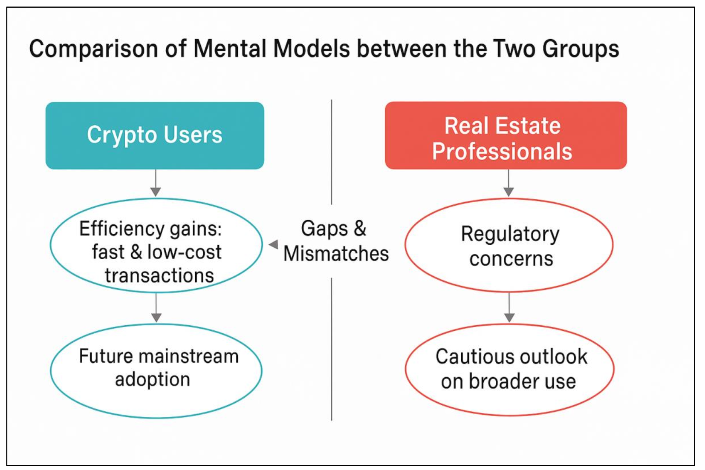
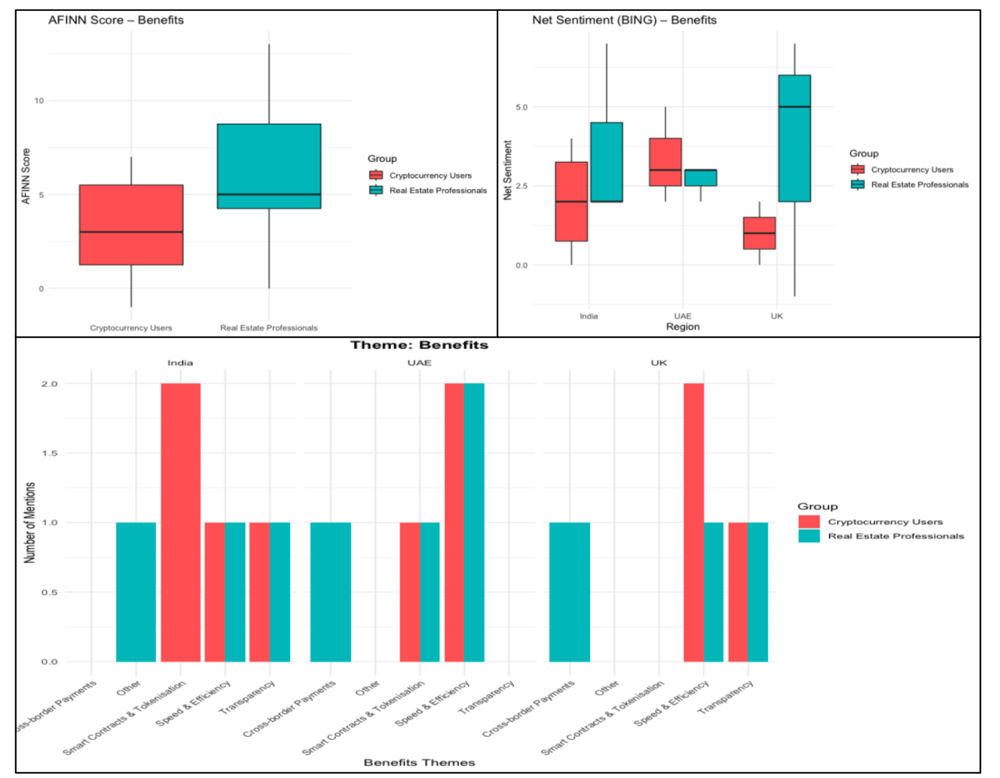
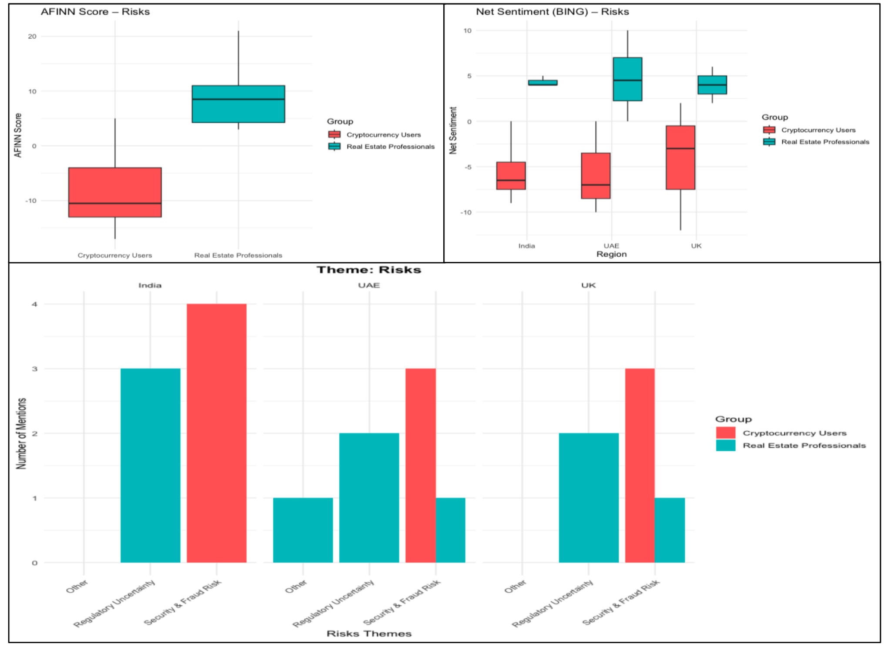
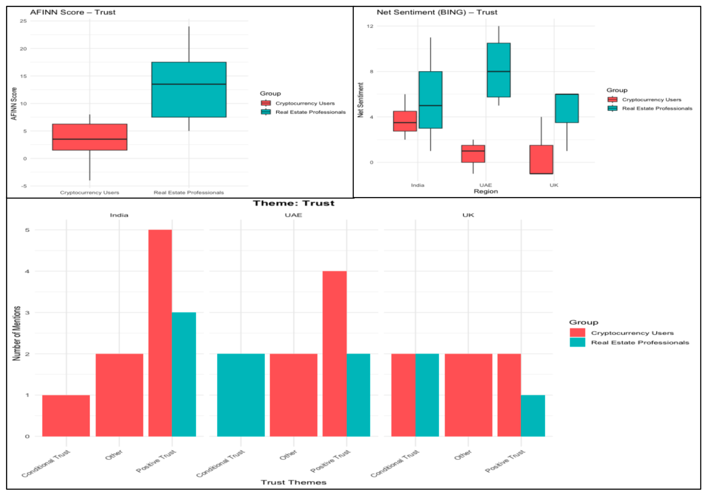
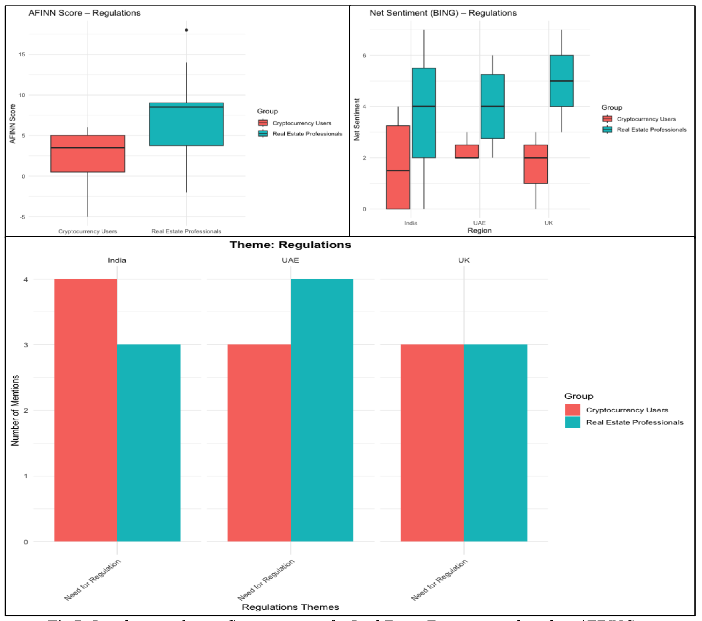
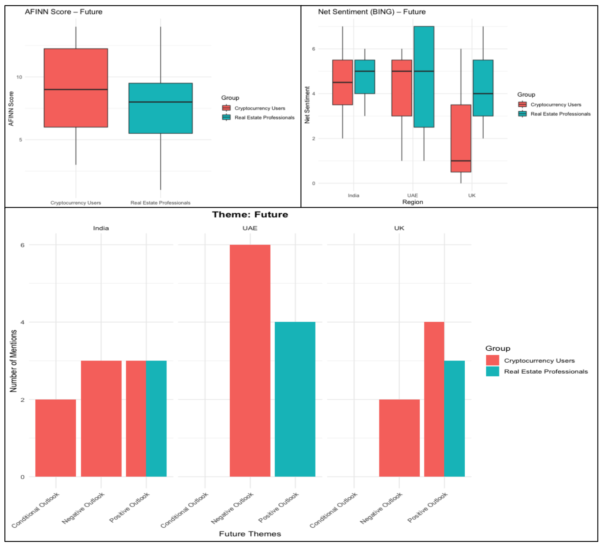
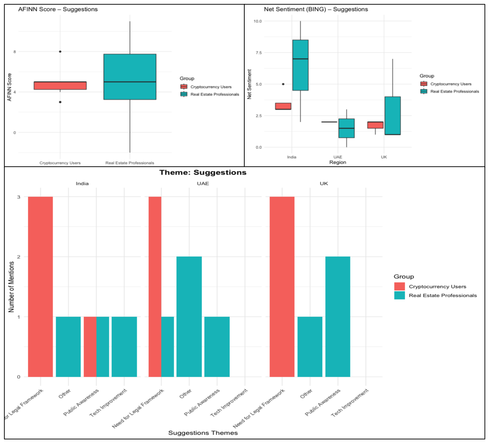
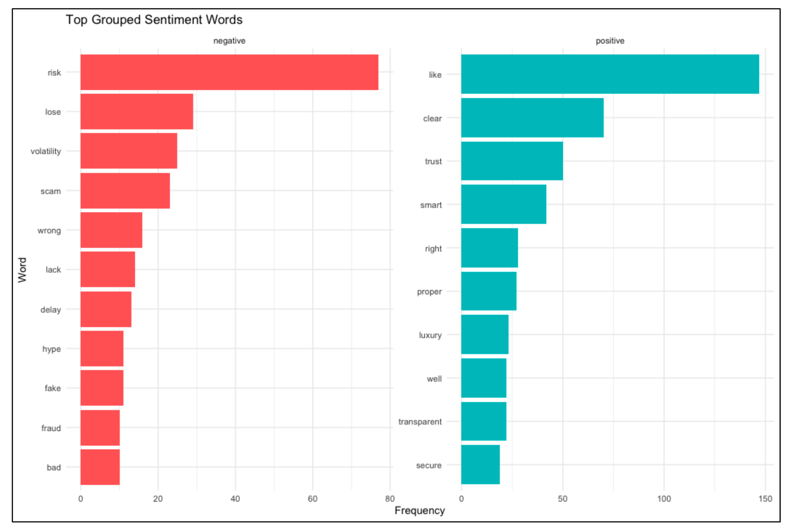

# Crypto in Real Estate — Public Perception (Qualitative + Sentiment)

**Goal:** Assess how cryptocurrency could be used in real estate and compare perceptions between **crypto users** and **real‑estate professionals** across **UK, India, UAE**.

## Highlights
- Semi‑structured interviews, coded into 6 themes: **Benefits · Risks · Trust · Regulations · Future · Suggestions**.
- **Sentiment analysis in R** (AFINN / BING) quantifies tone by theme, region, and group.
- **Users** → speed, low fees, transparency, tokenisation (positive).
- **Professionals** → regulation/AML/KYC, custody risk, volatility (cautious).
- **Regulatory clarity** is the main unlock; **UAE** more open; **UK** cautious; **India** mixed.

## Repo Layout
```
data/        # CSV outputs used to build figures
results/     # ready-to-use figures for portfolio & slides
scripts/     # R scripts (part 1: thematic, part 2: sentiment)
docs/        # 1-page recruiter summary (MD + PDF)
```

## Reproduce (R)
```r
# Install packages
source('install_packages.R')

# Run analyses (adapt file paths as needed)
source('scripts/part1_thematic_analysis.R')
source('scripts/part2_sentiment_analysis.R')
```

**Stack:** R (tidyverse, tidytext, ggplot2, readr, dplyr, stringr, forcats, tidyr)

> This project shows mixed‑method analysis (qualitative + quantitative), practical stakeholder insights, and clear visual communication.

## Visual Highlights

**Comparison of mental models (Users vs Professionals)**  


**Key Themes**  
  
  
  
  
  


**Sentiment Words**  

